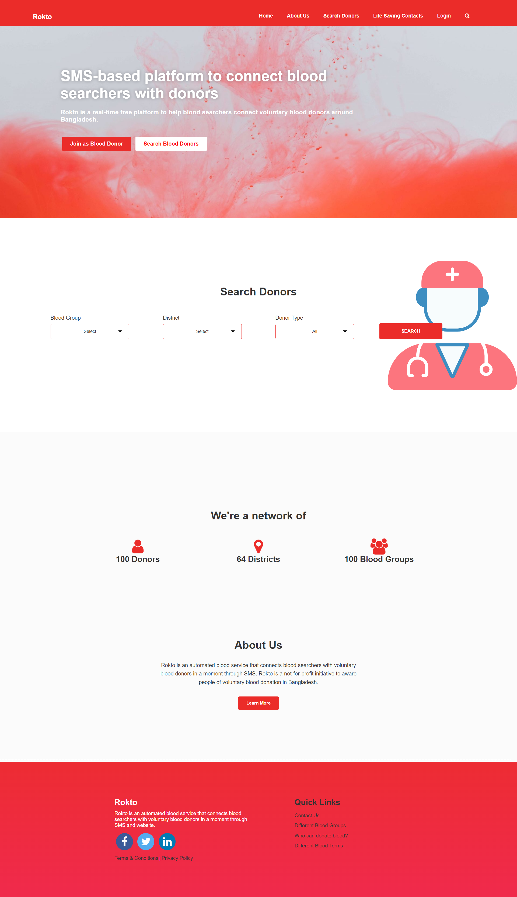

# Blood Donation Website

## Project Overview
The Blood Donation Website is a full-stack web application designed to connect blood donors with recipients efficiently. Users can register, log in, and search for available donors based on blood type and location. The admin panel allows managing donor requests, updating information, and monitoring donations.

---

## Features
- **User Registration & Login**: Secure authentication for donors and recipients.
- **Search Donors**: Find available donors by blood type and location.
- **Admin Panel**: Manage donor requests, verify registrations, and monitor donation status.
- **Responsive Design**: Works on desktops, tablets, and mobile devices.
- **Database Integration**: Stores donor information securely using MySQL.

---

## Screenshots
  
  
  

---

## Technologies Used
- **Frontend**: HTML, CSS, PHP
- **Backend**: PHP
- **Database**: MySQL
- **Version Control**: Git & GitHub

---

## Installation / How to Run
1. Clone the repository:
   ```bash
   git clone https://github.com/Nahida-shaik/Blood-Donation-website.git
